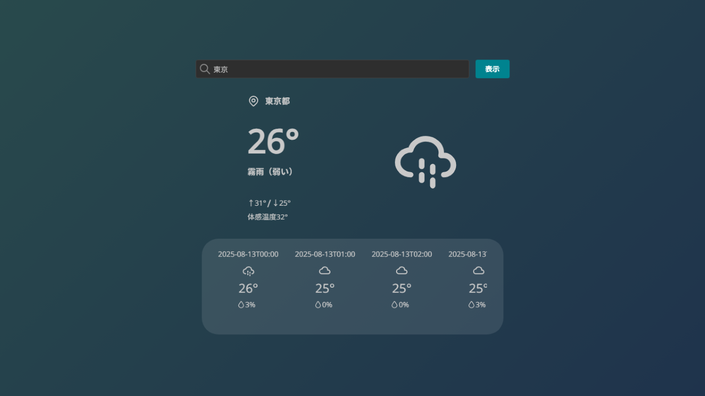

# mantine-weather-app

[](https://deploy.workers.cloudflare.com/?url=https://github.com/cloudflare/templates/tree/main/vite-react-template)

Mantine の学習用に作成した天気予報アプリです。

https://mantine-weather-app.rinatz.workers.dev/

[](https://mantine-weather-app.rinatz.workers.dev/)

## 技術スタック

- [**React**](https://react.dev/)
- [**Mantine**](https://mantine.dev/)
- [**Vite**](https://vite.dev/)
- [**Hono**](https://hono.dev/)
- [**Cloudflare Workers**](https://developers.cloudflare.com/workers/)

## 開発

ライブラリをインストールします。

```bash
npm install
```

開発サーバーを起動します。

```bash
npm run dev
```

[http://localhost:5173](http://localhost:5173) からアクセスできます。

## リリース

本番用ビルドを行います。

```bash
npm run build
```

ビルド結果をプレビューして確認します。

```bash
npm run preview
```

Cloudflare Workers にデプロイします。

```bash
npm run build && npm run deploy
```

デプロイしたら Workers をモニタリングします。

```bash
npx wrangler tail
```

## 参考

- [React ドキュメント](https://reactjs.org/)
- [Mantine ドキュメント](https://mantine.dev/getting-started/)
- [Vite ドキュメント](https://vitejs.dev/guide/)
- [Hono ドキュメント](https://hono.dev/)
- [Cloudflare Workers ドキュメント](https://developers.cloudflare.com/workers/)
